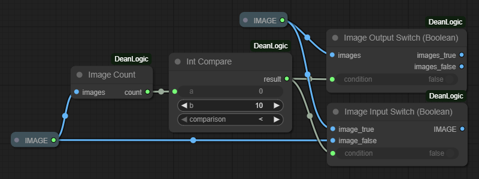

# ComfyUI-DeanLogic
Switch input or output path with boolean conditions

## Table of Contents
1. [Installation](#installation)
2. [Warning](#warning)
3. [License](#license)

##  Installation
Clone the repository into your custom_nodes directory or download packed file and extract it.

##  Warning
> [!WARNING]
> Using this means you are old enough to know the risks of the internet!

##  License
This project is licensed under the `MIT License`.